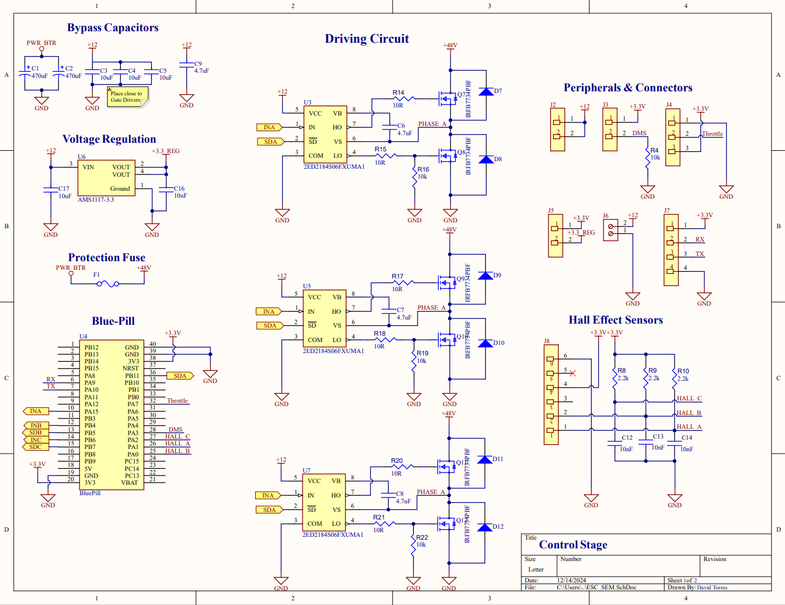
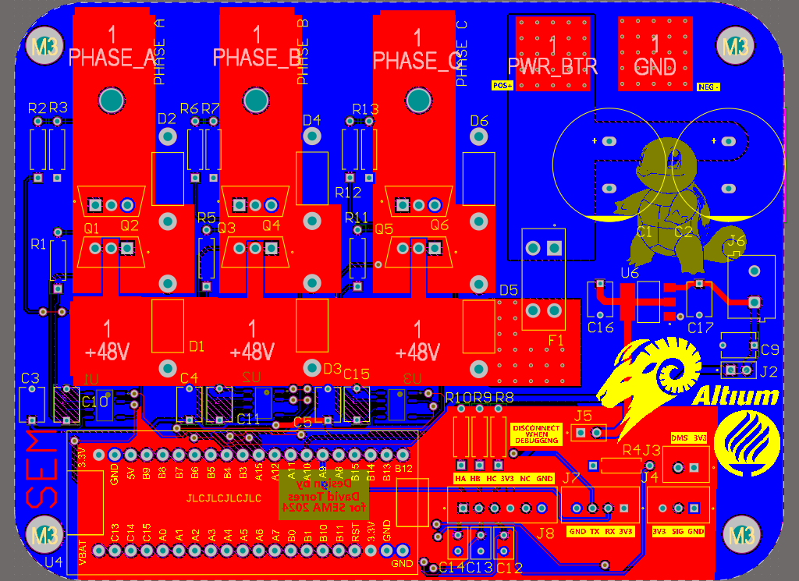

# Controller for BLDC Motor - Shell Eco-Marathon

## General Description of the Controller

This repository documents the development of a controller for BLDC motors, specifically designed for the vehicle competing in the Shell Eco-Marathon. Using an STM32F103C8T6 microcontroller, the controller enables precise and efficient control, leveraging advanced modulation and control techniques to maximize energy performance in competitive environments.

### Architecture and Key Components

1. **Microcontroller**: The STM32F103C8T6 is used, programmed in C/C++ within the STM32CubeIDE environment. This controller processes control signals and coordinates the motor phase sequence using PWM signals.
  
2. **Phase Control Using Hall Sensors**: Hall effect sensors are employed to detect rotor position, determining the switching sequence to adjust motor rotation at all speeds.
  
3. **Gate Driver and Power MOSFETs**: Low Rds(on) MOSFETs are used with a suitable gate driver for fast and efficient switching, based on examples utilizing drivers like the 2ED2184.
  
4. **Current Sensor**: Current in each phase is monitored using Hall effect sensors, with phase A configured with an ACS758 sensor to adjust consumption and protect the system from overloads.

### Software Features

- **PWM Modulation and Sinusoidal Sequence**: The controller employs sinusoidal waveform modulation to enhance efficiency, using PWM configured on the STM32 for each motor phase.
- **Automated Phase Switching**: An interrupt-driven system is implemented to switch phases based on the position detected by Hall sensors.
- **Current and Voltage Monitoring**: Using the STM32 ADC, the controller logs and adjusts motor energy consumption in real-time.

### Operating Scheme

1. **Soft Motor Start**: The controller starts in a low-consumption mode to reduce current surges during startup.
2. **Phase Detection and Control**: Hall sensors detect rotor position, allowing the controller to synchronize phase switching.
3. **Protection and Diagnostics**: The controller detects and responds to sensor failures or overcurrent conditions, protecting the system during operation.

### Technical Documentation

This repository includes:
- **Example Code in C/C++ for STM32**: Examples of configuring PWM and ADC on the STM32 for motor control.
- **Schematics and PCB Layout**: Connection diagrams in platforms like KiCad and Proteus.
- **Component Calculation Guides**: Documentation on selecting and calculating optimal values for MOSFETs and gate resistors.

For more information, refer to the documents in this repository or contact the development team.

## Schematics
 

## Board
 

## Software

- **PCB Layout:** Schematic design and layout was done using <a href = "https://www.altium.com/altium-designer">Altium Designer </a> with the help of licenses provided as part of their <a href="https://www.altium.com/education/sponsorships"> Team Sponsorhsip </a> Program

## Contact