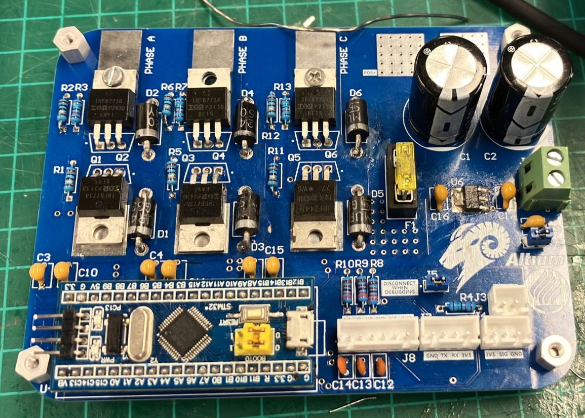

# Controller for BLDC Motor - Shell Eco-Marathon
 

## General Description of the Controller

This repository documents the development of a controller for BLDC motors, specifically designed for the vehicle competing in the Shell Eco-Marathon. Using an STM32F103C8T6 microcontroller, the controller enables precise and efficient control, leveraging advanced modulation and control techniques to maximize energy performance in competitive environments.

### Architecture and Key Components

1. **Microcontroller**: The STM32F103C8T6 is used, programmed in C/C++ within the STM32CubeIDE environment. This controller processes control signals and coordinates the motor phase sequence using PWM signals.
  
2. **Phase Control Using Hall Sensors**: Hall effect sensors are employed to detect rotor position, determining the switching sequence to adjust motor rotation at all speeds.
  
3. **Gate Driver and Power MOSFETs**: Low Rds(on) MOSFETs are used with a suitable gate driver for fast and efficient switching. Infineon's <a href = "files/IRFB7734PBF_DS_INFINEON.pdf">IRFB7734PBF</a> (max. 3.5 mohm) were ideal for this application. 
  
### Software Features

- **Automated Phase Switching**: An interrupt-driven system is implemented to switch phases based on the position detected by Hall sensors.
- **Current and Voltage Monitoring**: Using the STM32 ADC, the controller logs and adjusts motor energy consumption in real-time.
- **UART Bus**: The board features a UART serial bus for reliable communication, enabling data exchange between the controller and external devices or systems.

### Operating Scheme

1. **Phase Detection and Control**: Hall sensors detect rotor position, allowing the controller to synchronize phase switching.
2. **Dead Man Switch Implementation**: This controller employs the detection of an external signal triggered manually by the operator.
If the signal stops, the controller immediately disables motor operation, ensuring safety and preventing unintended actions.

### Technical Documentation

This repository includes:
- **Example Code in C/C++ for STM32**: Examples of configuring Timers and external interrupts to generate the necessary pulses for motor control.
- **Schematics and PCB Layout**: Connection diagrams and PCB layout made using Altium Designer.
- **Component Calculation Guides**: Documentation on selecting and calculating optimal values for MOSFETs and gate resistors.

For more information, refer to the documents in this repository or contact the development team.

## Schematics
 

## Board

 

## Software

- **PCB Layout:** Schematic design and layout was done using <a href = "https://www.altium.com/altium-designer" target = "_blank">Altium Designer </a> with the help of licenses provided as part of their <a href="https://www.altium.com/education/sponsorships" target = "_blank"> Team Sponsorhsip </a> Program.

- **Compiling & Debugging**: Done using <a href = "https://www.st.com/en/development-tools/stm32cubeide.html">STM32CubeIDE</a> 1.16.0 .   

## Contact

Feel free to reach out and follow our team's socials.