# Motor Control Explanation

This controller employs a six-step control commutation technique, commonly referred to as "Trapezoidal Commutation." The name stems from the trapezoidal shape of the back electromotive force (back-EMF) waveform generated in the motor windings during operation. In this method, the motor's phases are energized in a specific sequence based on the rotor's position, which is typically determined using Hall effect sensors (integrated within the hub motor). Trapezoidal commutation is favored for its simplicity and efficiency.

## Six-Step (Trapezoidal) Conmutation

### First Step
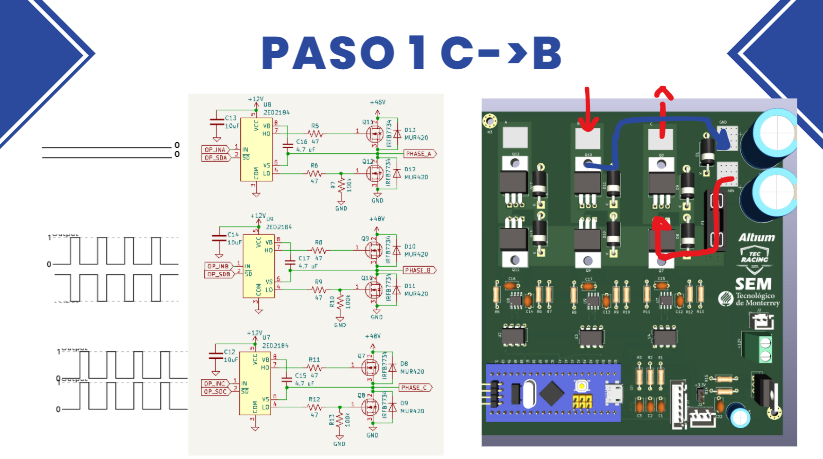 
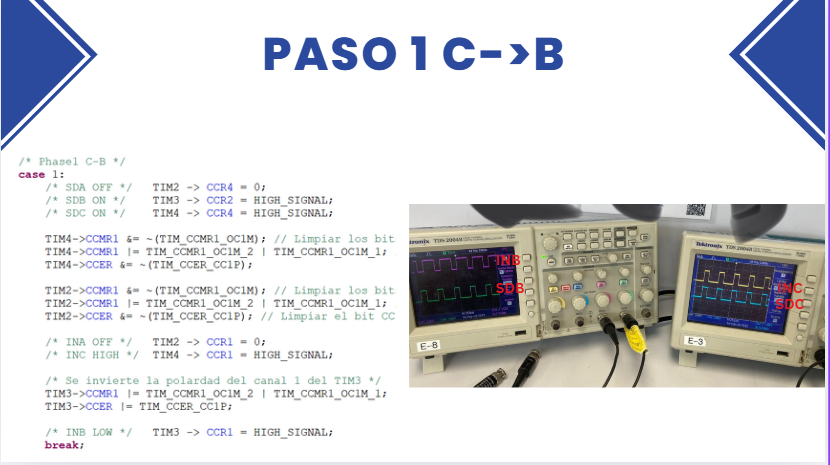 

### Second Step 

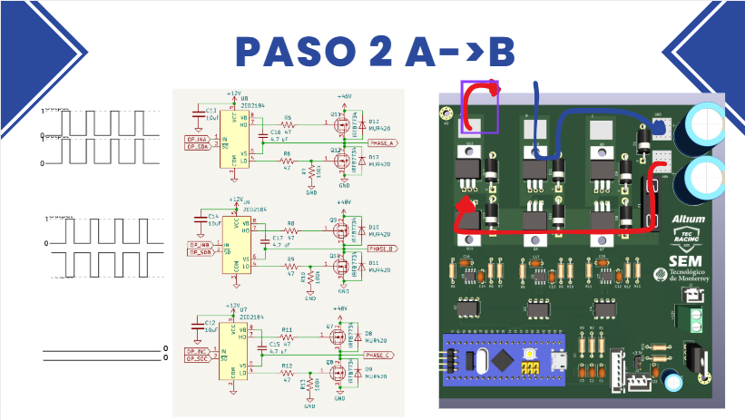 
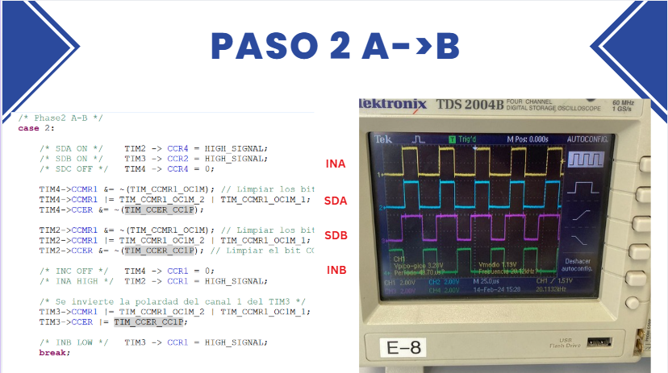 

### Third Step
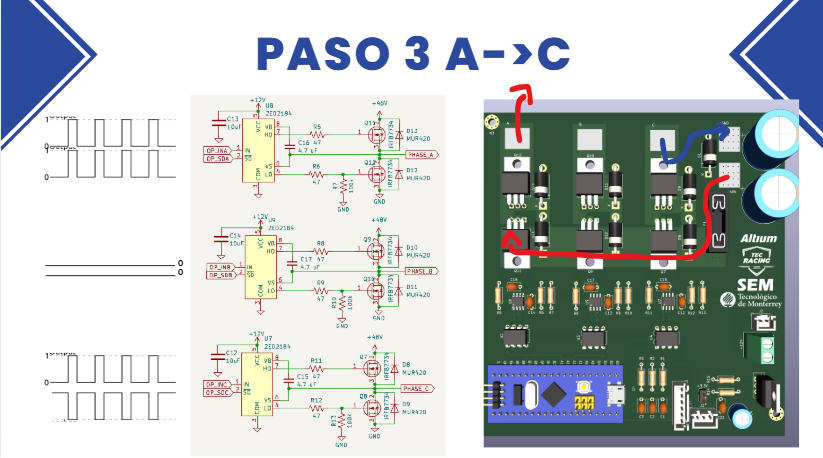 
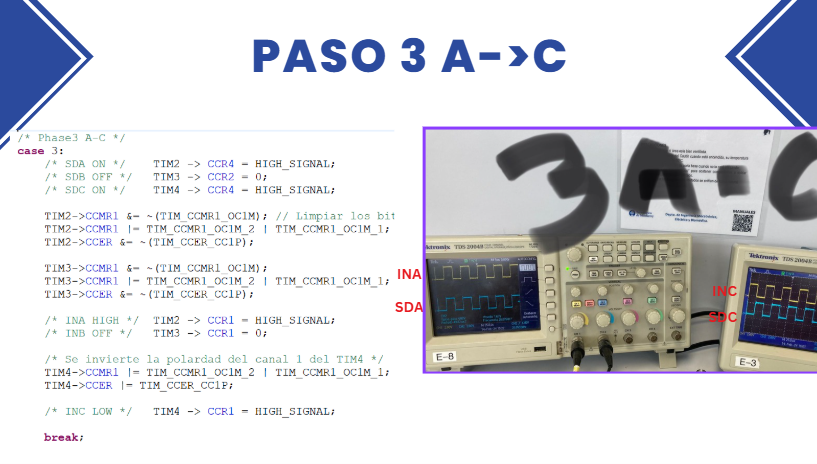 

### Fourth Step
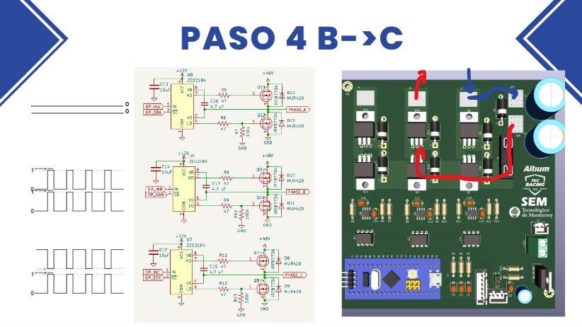 
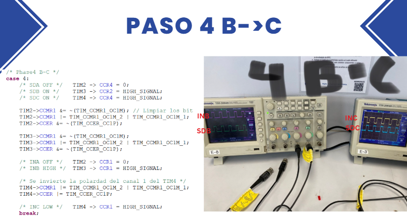 

### Fifth Step
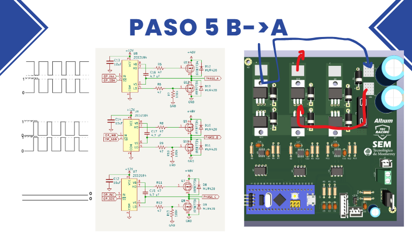 
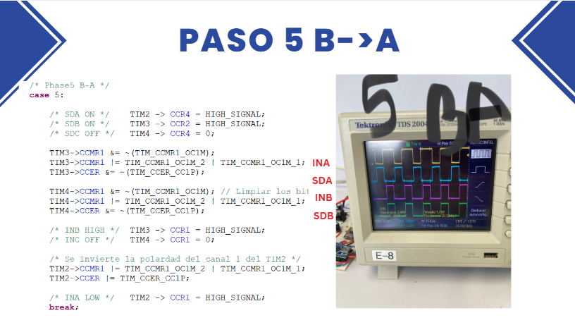 

### Sixth Step
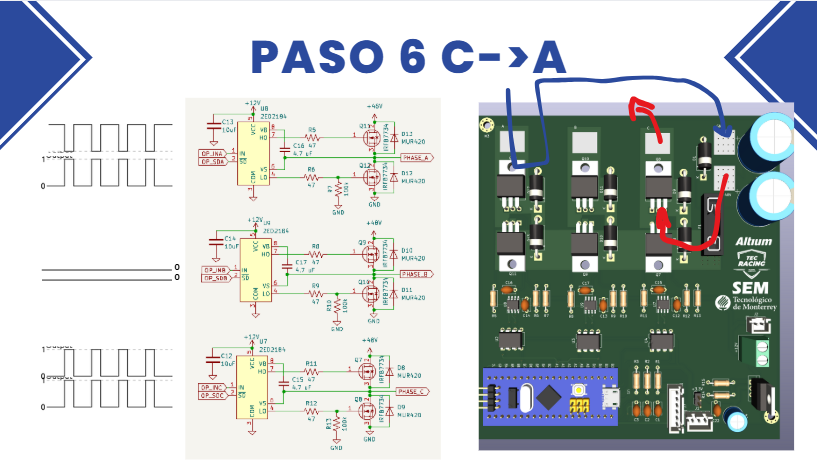 
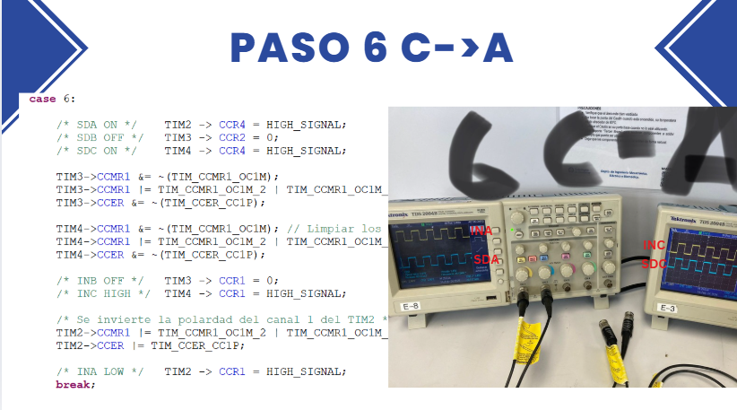 